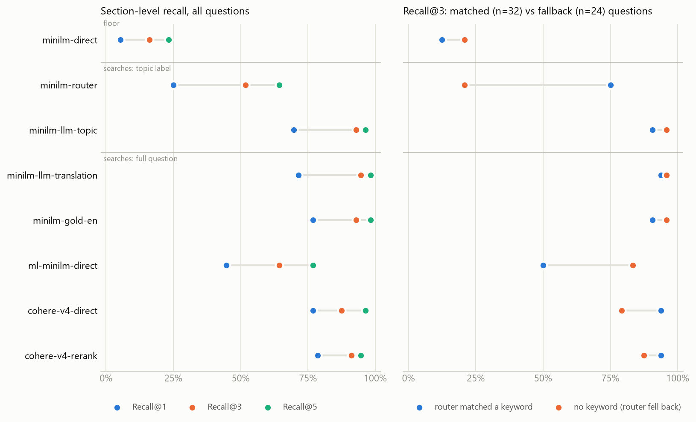

# Arabic questions over an English knowledge base: keyword routing, LLM rewriting and multilingual embeddings

A small, reproducible retrieval benchmark on a Saudi personal-finance knowledge base (7 English
Markdown documents).

The baseline retriever is `all-MiniLM-L6-v2`, an English-only embedding model. There are two
common ways to let Arabic questions reach an English-only retriever by rewriting the query into
English first:

- **Keyword router:** a substring dictionary maps Arabic keywords to English terms. The resulting
  topic string is searched on its own.
- **LLM router:** one JSON-mode LLM call classifies intent and returns `topic_en`, "3-8 ENGLISH
  keywords describing the topic". That topic string is searched on its own.

In both cases the question itself is discarded. If no topic is produced, the raw Arabic is
searched.

The alternatives are to translate the *full* question, or to embed the Arabic directly with a
multilingual model.

**The question:** where does retrieval quality go? Is it the English-only embedding model, or
rewriting the question into a topic label? And which fixes close the gap?

## TL;DR

Rows are grouped by *what text gets searched*. The embedder is MiniLM unless stated.

| Searched text | Config | R@1 | R@3 | MRR (95% CI) |
|---|---|---|---|---|
| raw Arabic (MiniLM can't read it) | `minilm-direct` — floor | 5% | 16% | 0.17 (0.11–0.23) |
| **topic label from keyword map** | `minilm-router` | 25% | 52% | **0.41** (0.32–0.51) |
| **topic label from LLM** | `minilm-llm-topic` | 70% | 93% | **0.81** (0.73–0.89) |
| full question, LLM translation | `minilm-llm-translation` | 71% | 95% | 0.82 (0.74–0.89) |
| full question, human translation | `minilm-gold-en` — ceiling | 77% | 93% | 0.85 (0.77–0.92) |
| full question, raw Arabic | `cohere-v4-direct` — Cohere embed-v4.0 | 77% | 88% | 0.84 (0.77–0.92) |
| full question, raw Arabic | `ml-minilm-direct` — free multilingual MiniLM | 45% | 64% | 0.58 (0.48–0.69) |
| full question, raw Arabic | `cohere-v4-rerank` — + rerank-v4.0-fast | 79% | 91% | 0.86 (0.78–0.93) |

1. **The large loss is in the keyword router.** Its MRR is 0.41 against about 0.81–0.85 for every
   configuration that searches a faithful English rendering of the question. It fails in two ways:
   - It silently degrades to the unreadable raw Arabic when no keyword matches.
   - When a keyword does match, it searches a generic label (`"loan debt"`). Even on the 32
     questions where it matched, the LLM's label beats it by +0.24 MRR (CI +0.11 to +0.37).
2. **LLM topic labels lose almost nothing on this set.** They score 0.81 against 0.85 for a human
   translation.
   - Replacing the LLM's topic label with an LLM translation, in the same call, changes MRR by
     **+0.01** (CI −0.07 to +0.08): the translation is better on 10 questions and worse on 9.
   - The model treats "3-8 keywords" as a short phrase that keeps the intent: `"debt repayment vs
     saving"`, `"is car insurance halal"`.
3. **The embedding model is not the bottleneck when the query text is good English.** MiniLM on a
   human translation (0.85) ties Cohere on raw Arabic (0.84). Cohere on raw Arabic also ties the
   LLM-topic route (+0.03, CI −0.08 to +0.15).
4. **There are fixes at both layers, and they reach the same level.**
   - *Query-rewriting layer:* have an LLM produce an English label or translation. It doesn't
     matter much which.
   - *Embedding layer:* use a multilingual embedder that searches the Arabic directly. That also
     removes the keyword router's silent fallback, because the fallback query (the raw Arabic)
     becomes searchable.
5. **Rerank adds nothing measurable** (+0.01, CI −0.06 to +0.09).

The LLM rows use Cohere `command-a-03-2025`. Finding 2 depends on the model writing phrase-like
labels, so it may not hold for other LLMs; see [Limitations](#limitations).

The eval set is a stress test for the keyword router (it deliberately includes out-of-map
vocabulary), not a sample of real traffic.

---

## Setup

### Corpus and chunking

The corpus is 7 English Markdown documents (`knowledge/`): budgeting, car financing (murabaha vs
conventional), emergency fund, financial planning, Islamic finance contracts, saving strategies,
and zakat. Together they are about 21 KB.

The chunking is header-aware (`bench/chunking.py`):
- one chunk per `##` section, plus each document's preamble;
- each chunk is prefixed with its document title and section heading;
- chunk ids are readable (`zakat#the-nisab-threshold`) and serve directly as eval labels.

This gives 38 chunks of 31–313 words.

### Eval set: `eval/questions_ar.json`

56 Arabic questions, each labelled with the chunk(s) that answer it:

| Register | n | Examples |
|---|---|---|
| Modern Standard Arabic | 16 | ما هو الحد الأدنى من الثروة الذي تجب فيه الزكاة؟ |
| Everyday Saudi phrasing | 19 | كم تطلع زكاتي إذا عندي ربع مليون بالبنك؟ · أبي أحول جزء من معاشي أول ما ينزل لحساب ثاني |
| Religious / financial terms | 13 | زكاة، مرابحة، تورق، حول، نصاب، إجارة منتهية بالتمليك، غرر، ميسر |
| Deliberately ambiguous | 8 | هل المرابحة أفضل؟ · أبي سيارة · الفلوس ما تكفي لآخر الشهر |

- 40 questions have one relevant chunk; 16 have 2–4.
- Each question also has a hand-written English translation (`gold_en`), used by the ceiling row.
- Many questions use vocabulary missing from the keyword map, or forms of mapped words that a
  substring match misses, such as زكاتي, الطوارى, قروض and اسلامي.
- تورق appears once in the corpus and not in the keyword map at all.

### Configurations (`bench/configs.py`)

| Config | Query text | Embedder |
|---|---|---|
| `minilm-direct` | raw Arabic | all-MiniLM-L6-v2 |
| `minilm-router` | keyword-map topic | all-MiniLM-L6-v2 |
| `minilm-llm-topic` | LLM `topic_en` | all-MiniLM-L6-v2 |
| `minilm-llm-translation` | same LLM call, `query_en` = faithful translation | all-MiniLM-L6-v2 |
| `minilm-gold-en` | human translation | all-MiniLM-L6-v2 |
| `ml-minilm-direct` | raw Arabic | paraphrase-multilingual-MiniLM-L12-v2 |
| `cohere-v4-direct` | raw Arabic | Cohere `embed-v4.0`, 1024 dims |
| `cohere-v4-rerank` | raw Arabic | `embed-v4.0` top-20 → `rerank-v4.0-fast` |

**The keyword router** (`bench/router.py`) is a 27-entry Arabic → English dictionary with
substring matching. The English terms of every matched key are joined and deduplicated. The topic
string is searched on its own, or the raw Arabic if nothing matched (`topic or message`). The
harness logs, per question, whether any keyword matched.

**The LLM router** (`bench/llm_router.py`) sends one call per question:
- **Model:** Cohere `command-a-03-2025`.
- **Prompt:** the system prompt is in `bench/prompts/classify_system.txt`. It asks for intent,
  purchase details and `topic_en`, as JSON.
- **User turn:** `Conversation so far:\n(no prior messages)\n\nMessage to classify:\n{question}`.
- **Settings:** JSON mode, temperature 0.0, max_tokens 400.
- **What gets searched:** the returned `topic_en` string on its own. If it's empty, or the response
  isn't valid JSON with a known intent, the raw Arabic is searched instead. That never happened:
  all 56 calls returned valid JSON with a topic.

**The translation row** uses the same prompt with exactly one field swapped. The code asserts the
swap happened and that nothing else changed:

```diff
-  "topic_en": string   // 3-8 ENGLISH keywords describing the topic, ALWAYS in English even for
-                       // Arabic messages. Used to search an English knowledge base.
-                       // e.g. "buying a car cash vs murabaha financing"
+  "query_en": string   // a faithful, complete ENGLISH translation of the user's message, ALWAYS
+                       // in English even for Arabic messages. Preserve everything that is asked,
+                       // including comparisons, conditions, amounts and every part of a multi-part
+                       // question. Do NOT summarize, do NOT answer, and do NOT reduce it to
+                       // keywords. Used to search an English knowledge base.
+                       // e.g. "If I lose my job, how long will my savings last, and should I
+                       //       stop paying my car installments?"
```

Both LLM rows therefore cost one call per question. A pipeline that already makes an
intent-classification call gets either rewrite without an extra request.

**Cohere embeddings.** These were checked against docs.cohere.com:
- `embed-v4.0` is the current multilingual model.
- `input_type` is `search_query` for queries and `search_document` for chunks. It's enforced per
  role, because the wrong value doesn't raise an error; it just retrieves worse.
- `rerank-v4.0-fast` is multilingual. `rerank-v3.5` is listed as not multilingual.

**Retrieval** is exact cosine similarity over L2-normalised numpy arrays: no vector database, no
LangChain.

### Metrics

- **Recall@k**: the share of questions with at least one labelled chunk in the top k. For
  multi-label questions this is the lenient "any hit" reading.
- **MRR**: the mean of 1/rank of the first relevant chunk.
- **Primary level**: section. **Secondary level**: document. With 7 documents, document-level
  recall saturates.
- **Uncertainty**: 95% percentile bootstrap CIs over questions, and paired bootstraps for
  differences.
- **Random baseline**: an exact random-ranking expectation is reported alongside.

## Results



| Config | Searched text | R@1 | R@3 | R@5 | MRR | 95% CI | Median query latency | Cost / 1k queries |
|---|---|---|---|---|---|---|---|---|
| `minilm-direct` | raw Arabic | 5% | 16% | 23% | 0.17 | 0.11–0.23 | 12 ms, CPU² | $0 |
| `minilm-router` | keyword-map topic | 25% | 52% | 64% | 0.41 | 0.32–0.51 | 14 ms, CPU² | $0 |
| &nbsp;&nbsp;↳ keyword matched (n=32) | | 38% | 75% | 91% | 0.57 | 0.45–0.69 | | |
| &nbsp;&nbsp;↳ no keyword → raw Arabic (n=24) | | 8% | 21% | 29% | 0.21 | 0.11–0.32 | | |
| `minilm-llm-topic` | LLM topic label | 70% | 93% | 96% | 0.81 | 0.73–0.89 | 1,133 ms¹ | $2.28¹ |
| `minilm-llm-translation` | LLM translation | 71% | 95% | 98% | 0.82 | 0.74–0.89 | 1,256 ms¹ | $2.51¹ |
| `minilm-gold-en` | human translation | 77% | 93% | 98% | 0.85 | 0.77–0.92 | 15 ms, CPU² | $0 + a translator |
| `ml-minilm-direct` | raw Arabic | 45% | 64% | 77% | 0.58 | 0.48–0.69 | 16 ms, CPU² | $0 |
| `cohere-v4-direct` | raw Arabic | 77% | 88% | 96% | 0.84 | 0.77–0.92 | 648 ms, API (n=20) | $0.0021 |
| `cohere-v4-rerank` | raw Arabic | 79% | 91% | 95% | 0.86 | 0.78–0.93 | 1,367 ms, API (n=20) | $2.00 |
| *random ranking (expected)* | | 4% | 11% | 18% | 0.14 | | | |

¹ **About the LLM rows' latency and cost.**
- Both are for `command-a-03-2025` over 56 calls each, including the local embed. Topic calls
  ranged from 0.9 to 8.4 s. Translation calls ranged from 0.9 to 2.5 s, plus one 123 s outlier,
  which was a slow response rather than a retry.
- The cost is about 660 input and 64–70 output tokens per call at $2.50 / $10 per 1M tokens.

² Local timings on a laptop CPU, with a full warm-up pass first. They moved by 5–10 ms between runs,
so treat them as rough figures.

Full tables are in [`results/results.md`](results/results.md). They include results by register,
document-level scores, LLM routing diagnostics and tokenizer diagnostics.

**Paired differences (section MRR, same 56 questions):**

| Comparison | What it isolates | ΔMRR | 95% CI | B better / A better |
|---|---|---|---|---|
| `minilm-direct` → `minilm-router` | keyword routing vs none | +0.25 | +0.15 to +0.34 | 28 / 4 |
| `minilm-router` → `minilm-llm-topic` | keyword label vs LLM label | **+0.40** | +0.29 to +0.51 | 38 / 3 |
| `minilm-llm-topic` → `minilm-llm-translation` | LLM label vs question (same call) | **+0.01** | −0.07 to +0.08 | 10 / 9 |
| `minilm-llm-translation` → `minilm-gold-en` | machine vs human translation | +0.03 | −0.02 to +0.08 | 5 / 4 |
| `minilm-llm-topic` → `cohere-v4-direct` | LLM label vs multilingual embedder | +0.03 | −0.08 to +0.15 | 15 / 13 |
| `minilm-llm-translation` → `cohere-v4-direct` | rewriting-layer fix vs embedding-layer fix | +0.03 | −0.07 to +0.13 | 12 / 10 |
| `minilm-gold-en` → `cohere-v4-direct` | English-only on perfect English vs multilingual on Arabic | −0.00 | −0.10 to +0.10 | 10 / 11 |
| `ml-minilm-direct` → `cohere-v4-direct` | free vs hosted multilingual | +0.26 | +0.14 to +0.38 | 28 / 7 |
| `cohere-v4-direct` → `cohere-v4-rerank` | rerank | +0.01 | −0.06 to +0.09 | 9 / 8 |

**Split by whether the keyword router matched (section R@3):**

| Config | Keyword matched (n=32) | No keyword → fallback (n=24) |
|---|---|---|
| `minilm-direct` | 12% | 21% |
| `minilm-router` | 75% | 21% |
| `minilm-llm-topic` | 91% | 96% |
| `minilm-llm-translation` | 94% | 96% |
| `minilm-gold-en` | 91% | 96% |
| `ml-minilm-direct` | 50% | 83% |
| `cohere-v4-direct` | 94% | 79% |
| `cohere-v4-rerank` | 94% | 88% |

## Error analysis

[`results/disagreements.md`](results/disagreements.md) lists every question where the
configurations disagree at @3. Each entry shows the keyword route, the LLM topic, the LLM
translation and the top-3 chunks per config. Each question is filed under the first of these pairs
that disagrees on it:

| Pair, in filing order | A misses, B hits | B misses, A hits |
|---|---|---|
| 1. LLM topic (A) vs LLM translation (B) | 2 | 1 |
| 2. keyword map (A) vs LLM topic (B) | 24 | 0 |
| 3. LLM topic (A) vs Cohere (B) | 2 | 1 |

20 more questions disagree only among the other configurations. None is missed by all of them.

### 1. Raw Arabic into MiniLM: barely better than random

`all-MiniLM-L6-v2` uses BERT's English WordPiece vocabulary, so Arabic comes out as letter-by-letter
fragments. Lowercasing also strips the hamza:

```
ما هو الحد الأدنى من الثروة الذي تجب فيه الزكاة؟
→ م ##ا ه ##و ا ##ل ##ح ##د ا ##ل ##ا ##د ##ن ##ى م ##ن ... ا ##ل ##ز ##ك ##ا ##ة [UNK]
```

The Arabic questions end up crowded into a small region of embedding space. **For 34 of 56
questions the top-ranked chunk was the same one**, `budgeting#categories-that-quietly-leak-money`.
R@3 is 16% against 11% for a random ranking. This matters for the keyword router, because it is
what the router falls back to.

### 2. Keyword router: silent fallback and generic labels

The keyword map matches surface forms, so ordinary morphology and spelling miss it. When nothing
matches, the raw Arabic goes to MiniLM, and on those 24 questions the router scores exactly the
baseline (R@3 21%). The LLM reads the same questions without trouble:

| Q | Arabic | Why the map misses | Keyword rank | LLM `topic_en` | LLM rank |
|---|---|---|---|---|---|
| q27 | كم تطلع **زكاتي** إذا عندي ربع مليون بالبنك؟ | زكاتي ⊅ زكاة (ة→ت before a suffix) | 29 | `zakat calculation bank balance` | 1 |
| q24 | صرفت من فلوس **الطوارى** على تصليح المكيف | hamza-less الطوارى ⊅ طوارئ | 31 | `emergency fund replenishment` | 1 |
| q32 | هل آخذ **قروض** شخصية عشان أدفع الإيجار؟ | broken plural قروض ⊅ قرض | 24 | `personal loans for rent payment` | 1 |
| q34 | هل أي منتج مكتوب عليه **اسلامي** يكون متوافق مع الشريعة؟ | hamza-less اسلامي ⊅ إسلامي | 20 | `sharia compliance of islamic financial products` | 1 |
| q16 | كيف أحدد **أهدافي** المالية بطريقة صحيحة؟ | أهدافي ⊅ هدف | 37 | `setting financial goals` | 1 |

When the map *does* match, it throws away the question and keeps a generic label:
- **The same string for different questions.** `"loan debt"` is sent for both q26 أسدد القرض
  الشخصي أول ولا أبدأ أحوش؟ ("pay the loan first or start saving?", rank 27) and q53 هل القرض حرام؟
  ("is a loan haram?", rank 1). The 32 matched questions collapse to 25 distinct query strings.
- **The word that mattered is dropped.** q35 التأمين على السيارة، هل هو حلال؟ becomes `"car vehicle
  islamic finance halal"`, losing *insurance*. The takaful section lands at rank 12; with the LLM
  label `"is car insurance halal"` it's rank 1.
- **Substring false positives.** In q30 أسكن في المدينة…, المدينة contains the key دين, so "debt"
  is added: `"salary income debt"`.

This is why even the *matched* questions favour the LLM's label: +0.24 MRR (CI +0.11 to +0.37).

### 3. LLM topic label vs searching the full question

The LLM's labels are short (median 5 words, against 11 for its translations). Only 2 of 56 exceed
the requested 8 words. But they keep the question's intent. On this set, the translation isn't
better overall (+0.01 MRR). The individual differences go both ways:

| Q | LLM `topic_en` | Rank | LLM translation | Rank |
|---|---|---|---|---|
| q26 | `debt repayment vs saving` | 13 | Should I pay off my personal loan first or start saving? | 4 |
| q17 | `emergency fund, job loss, savings` | 5 | How much emergency money should I have in case I lose my job? | 1 |
| q31 | `savings rate from salary` | 6 | What percentage of my salary should I save each month? | 3 |
| q52 | `budgeting, money not lasting until end of month` | 2 | I don't have enough money to last until the end of the month | 14 |
| q40 | `murabaha financing early repayment discount` | 1 | Am I entitled to a discount for early settlement of a Murabaha financing? | 3 |
| q46 | `ijara muntahia bi tamleek financing explanation` | 2 | What is Ijarah Muntahia bi Al-Tamlik? | 3 |

When a label compresses away a quantity ("how much", "what percentage") or the order of a trade-off
("first … or …"), it costs rank, as in q26, q17 and q31. When it adds interpretation, it helps: q52
is a complaint, and the label names the topic (*budgeting*) that the literal translation lacks.

The translation isn't flawless either. In q30, المدينة (Madinah) came out as "the city".

### 4. Where searching the full question still misses

- **q04** (how much to keep in an emergency fund): the LLM translation *and* the human translation
  both rank the answer 5th, because MiniLM prefers the document's intro chunk. Cohere ranks it 1st.
  This is an embedder weakness, not a rewriting one.
- **q26**: the best MiniLM result is rank 4 (LLM translation), while Cohere gets rank 1. MiniLM's
  top 3 are the goals, waiting-test and 50/30/20 sections, near-misses rather than the
  order-of-operations section that answers it.
- **q52**: the human translation ranks 17th. The labels for this complaint are debatable.

### 5. The multilingual embedders

- **Cohere on raw Arabic** misses the top 3 on 7 questions:
  - q25 أبي أحول جزء من **معاشي**… (rank 14);
  - q23 (Umrah savings, rank 5), where the keyword map's `"goal saving umrah"` hits the corpus's
    literal Umrah example;
  - q38 وش يعني تورق؟ (rank 5); no configuration puts tawarruq at rank 1 except the LLM topic
    label `"what is tawarruq financing"`;
  - four more at rank 4–7.
- **Rerank's effects cancel out.** It rescues q25 (14 → 1), q16 (4 → 1) and q23 (5 → 1), and breaks
  q37 (1 → 9) and q24 (2 → 9). At 38 chunks, with Cohere already at 96% R@5, there is little left
  for a reranker to fix.
- **The free `paraphrase-multilingual-MiniLM-L12-v2`** does well on everyday phrasing but collapses
  on terminology (R@3 38%). For example, q42 on hawl and nisab ranks 31st. Its 128-token limit
  truncates 21 of 38 chunks, but raising the limit to 256 or 512 made results slightly worse
  (MRR 0.56 and 0.54), so truncation isn't the cause.

## Implications

- **With an LLM rewriting the query, an English-only embedder is near the ceiling on this set.**
  Switching the topic label to a translation, or MiniLM to Cohere, gives no measurable gain here.
- **A keyword router is the weak point.** Used as the only route or as a fallback, it drops Arabic
  retrieval from about 0.81 to 0.41 MRR. On questions the map can't parse, it drops to the floor,
  and nothing surfaces this. There are fixes at both layers:
  - *Rewriting layer:* normalize hamza, ta marbuta and common suffixes before the substring match.
    That would recover some misses (e.g. زكاتي, الطوارى, اسلامي), but the labels would stay generic.
  - *Embedding layer:* a multilingual embedder makes the fallback query, the raw Arabic, itself
    searchable. Cohere `embed-v4.0` scores 0.84 on raw Arabic here, at about $0.002 per 1k queries
    and about 650 ms of network latency from this machine. It would also make query rewriting
    unnecessary. The local multilingual MiniLM (0.58) is a partial fix that needs no network.
- **Asking for a translation instead of a topic label** costs nothing extra in the same call. It's
  worth considering for multi-part or quantity questions (q26, q17, q31), but this benchmark doesn't
  show a net gain.
- **Rerank isn't worth adding at this corpus size.**

## Limitations

- **One LLM, one run.** The LLM rows use only `command-a-03-2025`, at temperature 0, with no
  repeated runs, so there's no estimate of run-to-run variation. The topic-label result depends on
  the model writing phrase-like labels rather than bare keyword lists; other LLMs may behave
  differently.
- **Few multi-part questions.** The set has few multi-part or comparison questions, which is exactly
  where a topic label is most likely to lose information. The topic-vs-translation comparison is
  weakly tested there.
- **Single-turn only.** Every question was sent with an empty conversation history, so follow-up
  questions that depend on context aren't tested.
- **Small and single-domain.** 56 questions over 38 chunks from 7 documents. MRR CIs are about
  ±0.08–0.10, which separates the keyword router from everything else but can't rank the top
  configurations against each other.
- **The eval set is a stress test, not a traffic sample.** It deliberately includes vocabulary
  missing from the keyword map. The 24/56 fallback rate describes this set, not real-world traffic.
- **Gold translations are hand-written and clean**, so the human-translation row is an optimistic
  ceiling.
- **Lenient recall on multi-label questions.** For the 16 multi-label questions, any hit counts.
- **These are system comparisons, not ablations.** The embedders differ in size, training data and
  dimensionality, not only in language coverage.
- **Latency figures aren't comparable across rows.** Local CPU timings, Cohere embed/rerank round
  trips and Command A calls, all from one machine, are different things.
- **Prices are unverified third-party figures** (2026): embed-v4.0 at $0.12 per 1M tokens,
  rerank-v4.0-fast at $2.00 per 1k searches, and command-a-03-2025 at $2.50 / $10 per 1M.
  cohere.com/pricing no longer lists per-token rates.
- **Hosted models can change** behind the same name.

## Reproducing

```bash
python -m venv .venv
.venv\Scripts\activate                # Windows; source .venv/bin/activate elsewhere
pip install -r requirements.txt
# .env (gitignored): COHERE_API_KEY=...

python run_eval.py --dry-run          # prints every API call it would make; sends nothing
python run_eval.py                    # asks for confirmation above 20 uncached calls
python run_eval.py --configs minilm-direct,minilm-router,minilm-gold-en,ml-minilm-direct   # local only, free
```

- **Caching.** Embeddings, rerank results, LLM responses and API latency samples are cached under
  `cache/` (gitignored). LLM responses are keyed by model, prompt hash and question.
- **Call budget for a fresh run.** It needs 190 Cohere calls: 78 embed/rerank plus 112 chat.
  Trial keys allow 1,000 calls per month across all endpoints. After that, re-runs are free.
- **Rate limits.** 429 and 5xx responses are retried with exponential backoff. Calls are spaced to
  trial limits: rerank 10/min, chat 20/min.
- **Validation.** The eval file is checked on startup, and the translation prompt asserts it
  differs from the topic prompt by exactly one field.

### Adding a model

Any sentence-transformers checkpoint is one line in `bench/embedders.py`:

```python
EMBEDDERS["e5-large"] = lambda: SentenceTransformerEmbedder("intfloat/multilingual-e5-large")
```

and one entry in `bench/configs.py`:

```python
Config("e5-direct", "full question — raw Arabic", "Arabic -> multilingual-e5-large", "e5-large", arabic),
```

(E5 expects `query: ` / `passage: ` prefixes, which would be a small `Embedder` subclass.) A new
API provider is one `Embedder` subclass implementing `_embed(texts, role)`, and a new query rewrite
is one `prepare` function. Caching, call planning, latency measurement and reporting come with it.

## Layout

```
bench/chunking.py      header-aware Markdown splitter
bench/router.py        keyword router + fallback instrumentation
bench/llm_router.py    LLM router: topic_en call and its translation variant (command-a-03-2025)
bench/prompts/         the LLM system prompt
bench/embedders.py     Embedder interface, MiniLM / Cohere backends, disk cache, retry/backoff
bench/rerank.py        Cohere Rerank with throttle + cache
bench/configs.py       the eight configurations
bench/metrics.py       Recall@k, MRR, bootstrap CIs, random baseline
bench/report.py        results.md, chart.png, disagreements.md, per_query.jsonl
eval/questions_ar.json
run_eval.py
results/               generated; committed so the numbers above can be checked
```
